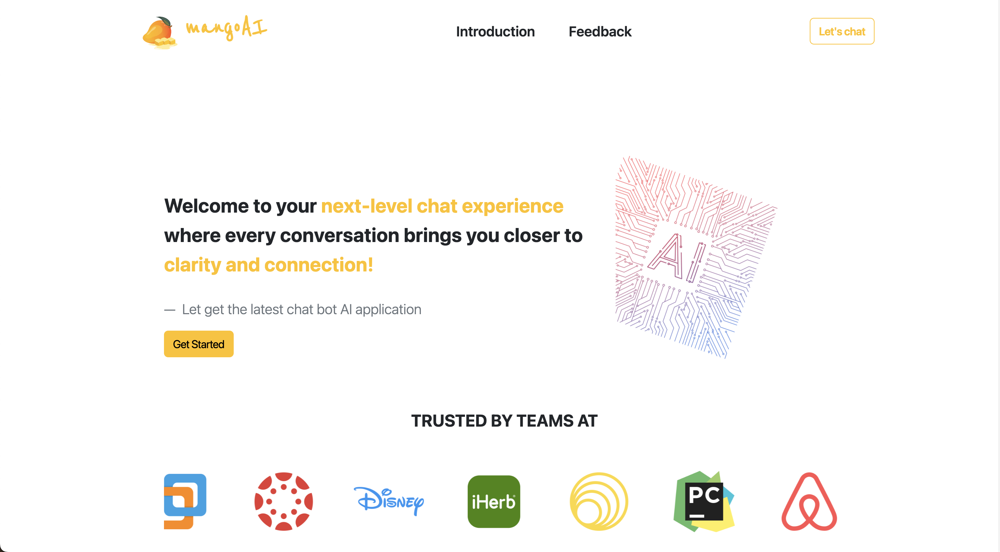
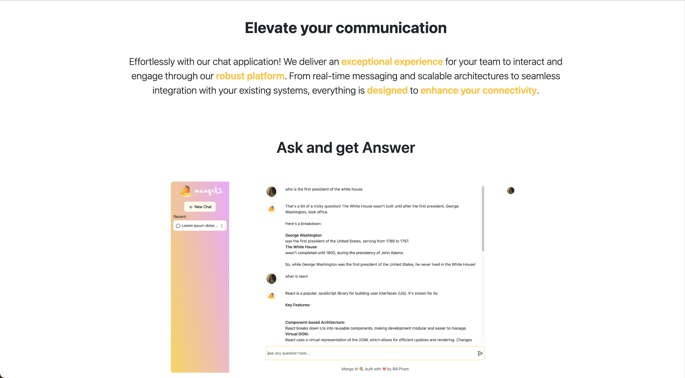
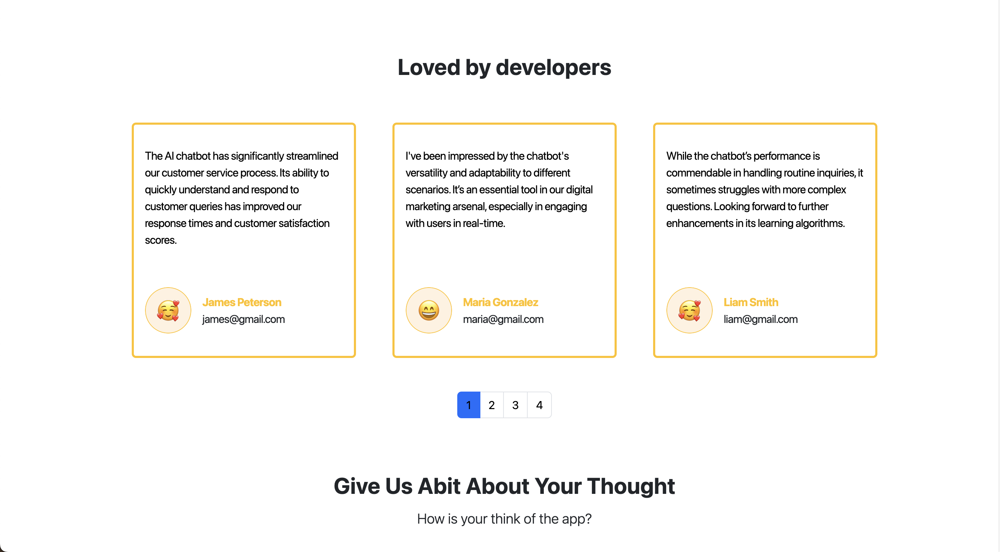
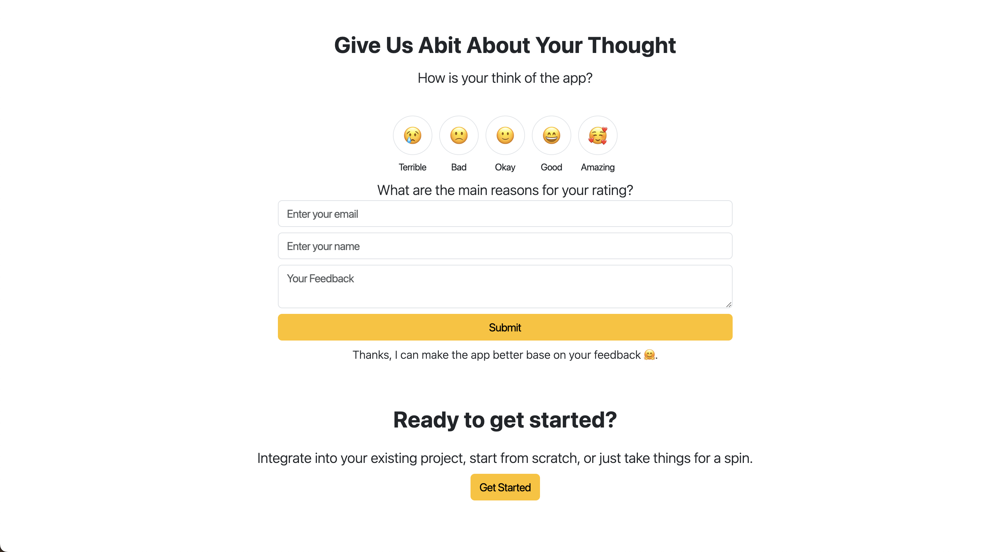
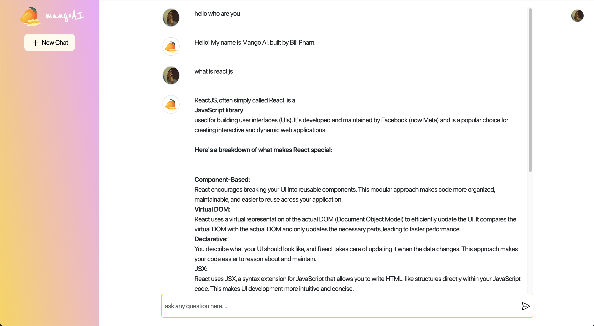
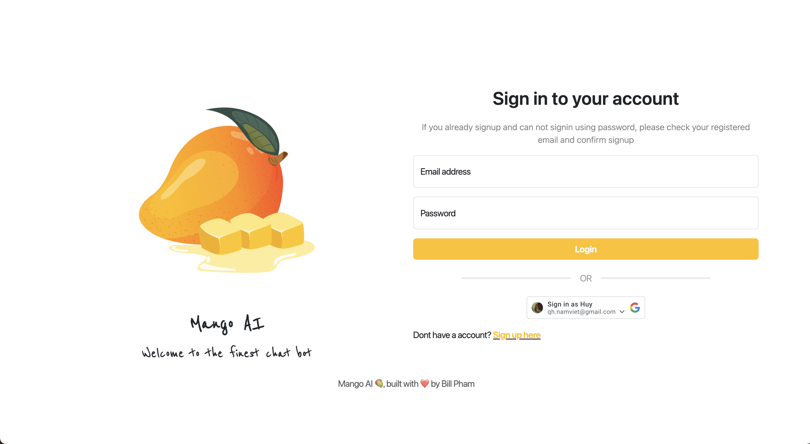
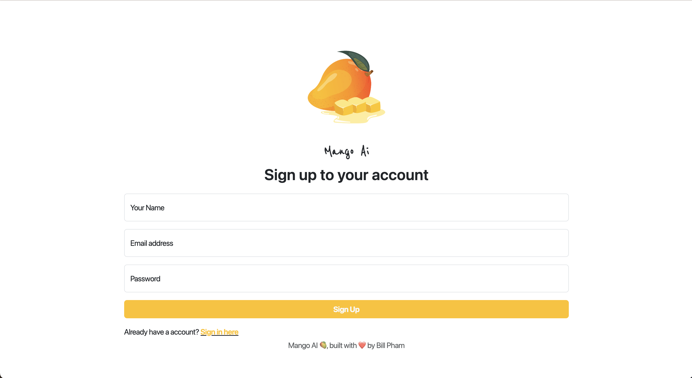

# Full Stack Chatbot Web Application with Vuejs, Bootstrap css, Supabase, and Gemini AI API

This repo belong to Pham Nguyen Quang Huy @ Swinburne University of Technology, any attempt to use or reuse the code with out permission is prohibited

### Home Page
 
 
 
 

### Chat Page
 

### Login Page
 

### Signup Page
 

___

this is a repository for a full stack chatbot web application with Vuejs, Bootstrap css, Supabase, and Gemini AI API

features:

* Responsive Design
* State Management using Pinia
* Ticker
* Pagination
* Dynamic Update Pagination
* Authenticated with Google OAuth and password base
* Chat Response in real-time with Gemini AI API


___

# Clone the repository

```
git clone https://github.com/bbi3mn4u69/Mango-AI-chatbot.git
```
___

# Install packages

```
npm i
```

___

# Setup the environment variables

```
VITE_GOOGLE_CLIENT_ID = your google client id
VITE_SUPABASE_URL = your supabase url
VITE_SUPAKEYS = your supabase anon key
VITE_GEMINI_API_KEYS = your gemini api key
```

___

# Start the development mode

```
npm run dev
```

## Recommended IDE Setup

[VSCode](https://code.visualstudio.com/) + [Volar](https://marketplace.visualstudio.com/items?itemName=Vue.volar) (and disable Vetur).

## Customize configuration

See [Vite Configuration Reference](https://vitejs.dev/config/).

# Mango-AI-chatbot 
